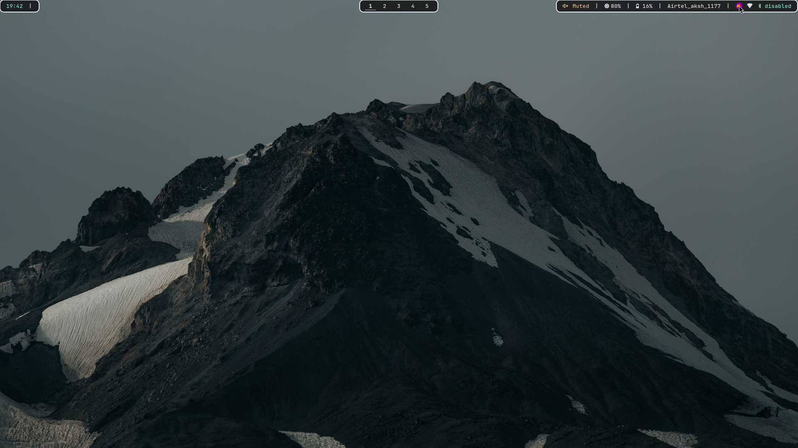
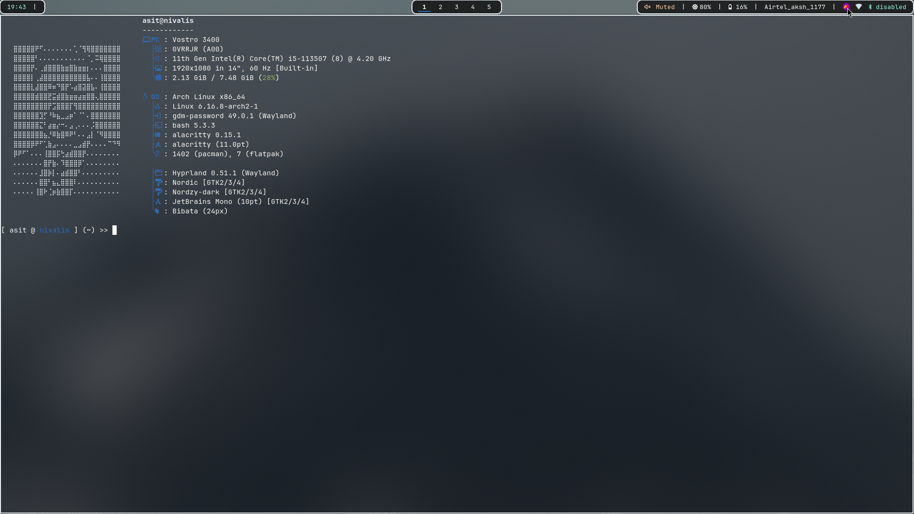

ArchLinux/Hyprland Dotfiles.
---

  
Prerequisites

  <ul>
    <li>hyprland</li>
    <li>hyprpaper</li>
    <li>rofi</li>
    <li>alacritty</li>
    <li>wlogout</li>
    <li>waybar</li>
    <li>fastfetch</li>
    <li>pipewire</li>
    <li>pavucontrol</li>
    <li>spotify</li>
    <li>vim</li>
    <li>neovim</li>
    <li>network-manager-applet</li>
  </ul>

---

---

---

